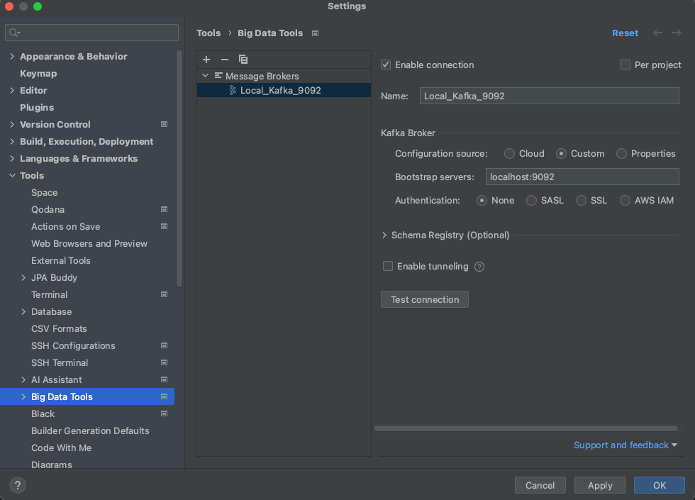

# Getting Started

### Reference Documentation
This project does not have the "producer" or "consumer" configuration classes because of that the necessary configuration was given by YML

KAFKA local installation
Download from ;

https://kafka.apache.org/downloads


KAFKA QuickStart documentation;

https://kafka.apache.org/quickstart

Enough is set up for the zookeeper and kafka servers to start running.

```
KAFKA_PATH/bin/zookeeper-server-start.sh config/zookeeper.properties
```
and
```
KAFKA_PATH/bin/kafka-server-start.sh config/server.properties
```

### Testing
```
curl -L 'http://localhost:8080/api/v1/message' -H 'Content-Type: application/json' -d '{
    "name": "John",
    "surName": "Doe"
}'
```

Or you can use the "KafkaTestControllerIntegrationTest" test class

### For more details,
* sh KAFKA_PATH/bin/kafka-console-consumer.sh --bootstrap-server localhost:9092 --topic kafka_topic --from-beginning

* or you can use the intellij kafka plugin

